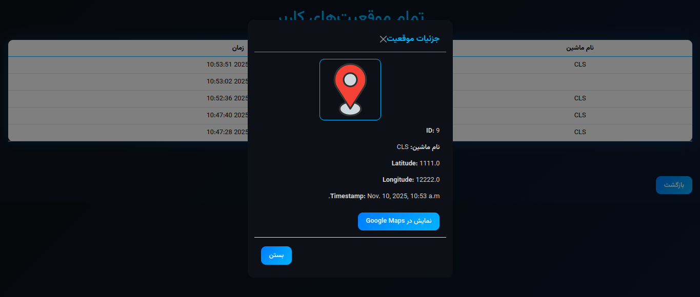
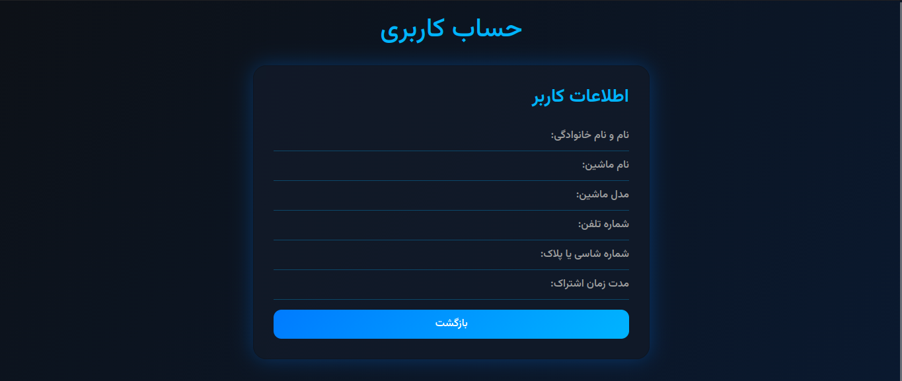

# Car Location Tracking System

The **Car Location Tracking System** is designed to track the real-time location of vehicles using GPS data collected by Arduino and the SIM800 module. The location data is sent to a Django-based server, where it is stored in a database for future use. This project is ideal for vehicle fleet management, personal car tracking, or location-based services.

## Features

- **Real-time Vehicle Tracking**: Track the location of vehicles using GPS data sent from an Arduino with a SIM800 module.
- **Django Backend**: A robust, scalable server built with Django that handles incoming data and manages vehicle locations.
- **Location Data Storage**: Store the latitude and longitude of each vehicle in a database for later retrieval.
- **API Integration**: Exposed APIs to receive and send location data for vehicles.

## Technology Stack

- **Arduino**: Microcontroller used to collect GPS data via the SIM800 module.
- **Django**: Web framework for the backend server.
- **SQLite**: Default database for storing vehicle and location information (can be swapped with PostgreSQL or MySQL for scaling).
- **SIM800 Module**: GSM module used to send HTTP requests with vehicle location data.
- **TinyGPS++**: Library used to interface with the GPS module in Arduino.

## Prerequisites

To set up this project locally, make sure you have the following software and hardware requirements:

### Software:
- **Python 3.x**: Required to run the Django server.
- **Django**: The backend web framework.
- **SQLite**: Default database used by Django (You can configure another database like PostgreSQL if needed).
- **Arduino IDE**: To program the Arduino microcontroller.
- **Sim800 AT Commands**: For communicating with the GSM module.

### Hardware:
- **Arduino Board**: Such as Arduino Uno or Nano.
- **GPS Module (e.g., NEO-6M)**: For acquiring location data (latitude, longitude).
- **SIM800 Module**: For sending data over the mobile network.

## Installation

### 1. **Clone the Repository**

First, clone the repository to your local machine:

```bash
git clone https://github.com/DevALIGhasemi/car_server.git
cd car_server
```

### 2. **Set Up Virtual Environment**

Create a Python virtual environment and install all dependencies:

```bash
python3 -m venv venv
source venv/bin/activate  # On Windows use `venv\Scriptsctivate`
pip install -r requirements.txt
```

### 3. **Set Up Database**

Run the following command to set up the database and migrate the models:

```bash
python manage.py migrate
```

### 4. **Run the Django Server**

Start the Django development server:

```bash
python manage.py runserver
```

The server will now be available at `http://127.0.0.1:8000/`.

## How It Works

### 1. **Collecting Location Data with Arduino**

The Arduino, paired with a GPS module, collects geographic coordinates (latitude and longitude). These values are then sent via the **SIM800 module** to the Django server.

### 2. **Sending Data to Server**

The Arduino sends location data to the Django server via an HTTP `POST` request. The SIM800 module allows the Arduino to transmit this data over the mobile network.

### 3. **Data Handling on Server**

On the server, two primary models are used:

- **Car Model**: Stores information about the vehicle, identified by its unique IMEI number.
- **Location Model**: Stores location data (latitude, longitude) and the timestamp of when the data was received.

### 4. **APIs**

There are two main API endpoints exposed to interact with the system:

- **POST** `/api/update-location/`: Receives and stores a new vehicle location.
- **GET** `/api/last-location/{imei}/`: Retrieves the latest location of a vehicle by its IMEI number.

### Example Request to Update Location (POST)

```json
{
    "name": "Car_123",
    "imei": "123456789012345",
    "latitude": 35.6895,
    "longitude": 139.6917
}
```

### Example Response

```json
{
    "id": 1,
    "name": "Car_123",
    "car": 1,
    "latitude": 35.6895,
    "longitude": 139.6917,
    "timestamp": "2025-12-30T12:34:56Z"
}
```

### Example Request to Get Last Location (GET)

```bash
GET http://127.0.0.1:8000/api/last-location/123456789012345/
```

### Example Response

```json
{
    "id": 1,
    "name": "Car_123",
    "car": 1,
    "latitude": 35.6895,
    "longitude": 139.6917,
    "timestamp": "2025-12-30T12:34:56Z"
}
```

## Mobile Application Integration

This system can be extended by building a mobile application that interacts with the provided API endpoints. The mobile app can:

- Fetch and display the real-time location of vehicles.
- Send location updates (if integrated with GPS and a mobile data module).
- Display vehicle location history on a map.

The mobile app can use the provided API to get vehicle data and display it on a user-friendly interface.

## Arduino Code for Sending Location Data

Below is the basic Arduino code for sending location data to the server using the SIM800 module:

```cpp
#include <SoftwareSerial.h>
#include <TinyGPS++.h>

SoftwareSerial ss(7, 8); // RX, TX
TinyGPSPlus gps;

void setup() {
  Serial.begin(9600);
  ss.begin(9600);
  // Initialize SIM800 module
}

void loop() {
  while (ss.available() > 0) {
    gps.encode(ss.read());

    if (gps.location.isUpdated()) {
      double lat = gps.location.lat();
      double lon = gps.location.lng();

      // Send data to server
      String url = "http://your-server-ip/api/update-location/";
      String payload = "{"name":"Car_123","imei":"123456789012345","latitude":" + String(lat) + ","longitude":" + String(lon) + "}";

      // Send HTTP POST request using SIM800
      sendHttpPost(url, payload);
    }
  }
}

void sendHttpPost(String url, String payload) {
  // Implement HTTP POST request using SIM800 module
  // This section includes sending AT commands to SIM800 for sending data
}
```

## Hardware Requirements

- **Arduino Board**: Any Arduino model such as Arduino Uno or Nano.
- **GPS Module (e.g., NEO-6M)**: Used to receive geographic coordinates.
- **SIM800 Module**: Used to send data to the server via the GSM network.

## Suggested Improvements

- **Map Integration**: Integrate a map (such as Google Maps) to display the real-time location of vehicles on a dashboard.
- **Mobile Application**: Build a mobile application to view and manage vehicle locations on the go.
- **Scalability**: Switch to a more scalable database like PostgreSQL or MySQL for handling large fleets.
- **Security**: Implement token-based authentication for the APIs to ensure secure communication.

## Screenshot of the Application

### Main Application


### GPS


### Account



## License

This project is licensed under the MIT License - see the [LICENSE](LICENSE) file for details.
